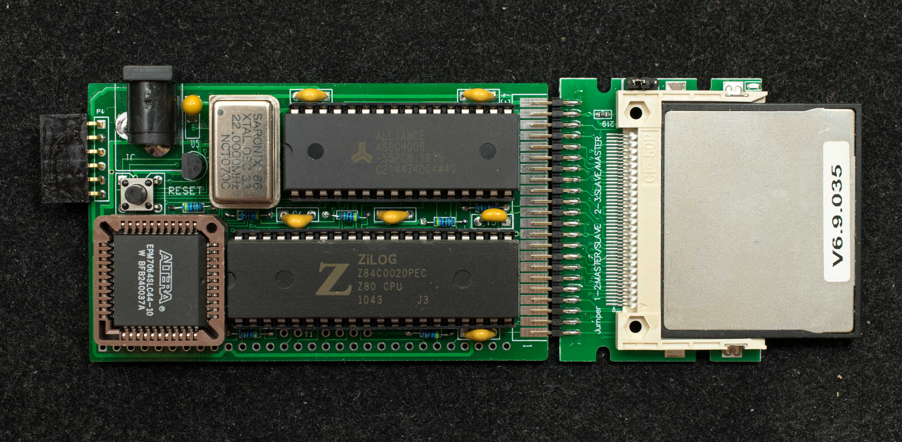

# ZRCC Rev1.0
Rev 1.0 is obsolete.  It is archived here.

I like the idea of a low-cost Z80 running CP/M with minimum component count, but I don't like Z80 having to share the spot light with a processor many times its performance. So instead of using a powerful modern microcontroller as the I/O processor, I used a CPLD instead. The CPLD is Altera EPM7064S which is compatible with Atmel ATF1504. The CPLD's logic fabric can emulate a small ROM, 64 bytes, a simple serial port, and glue logic functions. The small ROM is enough to load program from the compact flash disk into RAM and execute. In case the compact flash is new and un-initialized, the ROM can also read in program from the serial port to initialize the new CF disk and load it with boot program. Beside the internal ROM, the CPLD also implemented a simple serial receiver and bit-bang serial transmitter. The serial receiver is just glorified shift register with fixed baud rate and protocol, 115200-N-8-1. The remaining CPLD is glue logic.

### Features
- Z80 running at 22MHz
- 128K banked RAM, 512K optional
- EPM7064S CPLD
- Compact flash drive
- CP/M-ready
- 26-pin I/O expansion (RC2014-lite)
- Optional I2C bus
- 84mm x 51mm 2-layer pc board
### Theory of Operation
The heart of ZRCC is the EPM7064S CPLD. It contains a 64-byte boot ROM, a buffered shift register that serves as simple serial receiver, and decoding logic. At powerup, the Z80 executes the small ROM code which continuously polls the compact flash READY signal and the serial port receive ready flag. If serial receive ready flag is set, then it jumps into the serial bootstrap routine that loads 256 serial data into memory starting from 0xB000 and jump into 0xB000 after the 256th serial data is received.

If CF READY is detected, it jumps into the CF bootstrap routine that reads the 256 words of data from CF's Master Boot Record (track 0, sector 1) into memory starting from 0xB000 and jump into 0xB000 after the 256th words are read.

Because it takes a moment for the CF disk to be ready after reset, the user can wait a second for the CF disk to be ready and boot or press a key immediately after reset button is released and select the serial bootstrap mode. The serial bootstrap is primarily for loading CF initialization software to set up a new CF disk.

### Design Information
- Schematic

- Gerber photoplots

- Bill of Materials

- CPLD equations

- Memory map

### Software
- ZRCC monitor

- CP/M2.2 BIOS/CCP/BDOS

### Manuals
- Getting started with ZRCC
