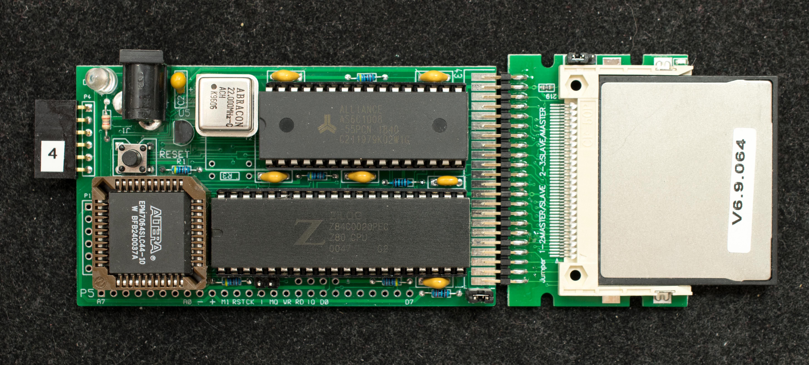
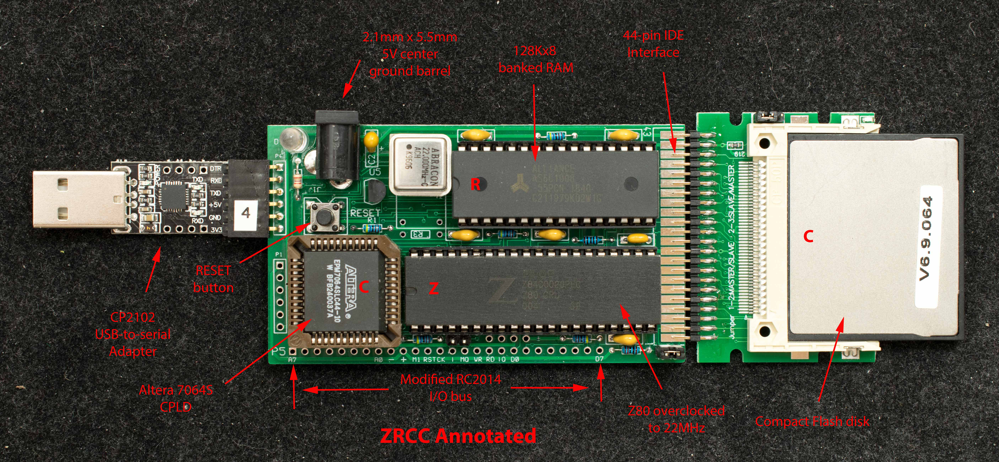

# Getting Started with ZRCC
### Introduction
This document is intended for two groups of audiences: hobbyists who have built ZRCC from scratch, and hobbyists who have purchased an assembled and tested ZRCC. The first part of the document is for hobbyists who have built ZRCC from scratch. Skip to here for ZRCC that's already assembled and tested.

### Assemble a ZRCC
Refer to the Pictorial Assembly Guide for step-by-step assembly of the board

Once the board is fully assembled and populated with IC, continue to the steps below.

### Operate an assembled and tested ZRCC

ZRCC requires regulated 5V, 250mA power from a 2.1mmX5.5mm power plug. The center lead is 5V and the barrel is ground. ZRCC also requires an USB-to-serial adapter. The inexpensive 6-pin CP2102 adapter is recommended because ZRCC's serial port header is design specifically for it.

www.retrobrewcomputers.org_lib_plugins_ckgedit_fckeditor_userfiles_image_builderpages_plasmo_zrcc_zrcc1_cp2102_6-pin.jpg

Set up the serial port emulator to 115200 N81, no handshake. For Windows users, TeraTerm is recommended. The CF disk is already loaded with software so when powered up, it wil display the following message:

ZRCC Monitor v0.3 4/25/20

>

This is the ZRCC Monitor. The help command is 'h'.

help G <addr> CR
R <track> <sector>
D <start addr> <end addr>
I <port>
O <value> <port>
L <start addr> <end addr>
Z CR
F CR
T CR
E <addr>
X <options> CR
B <options> CR
C <options> CR
The command to run SCMonitor is 'b1'

boot CP/M
1–User Apps,
2–CP/M2.2:
3–CP/M3: 1 press Return to execute command

Small Computer Monitor - Z280RC
*

The Startrek program is pre-loaded into memory with this version of SCMonitor, so type “wbasic” then “run” you should see the Startrek screen

THE USS ENTERPRISE — NCC-1701

,——*——,
,————- '— ——'
'——– –' / /
,—' '——-/ /–,
'—————-'

YOUR ORDERS ARE AS FOLLOWS:
————————–
DESTROY THE 19 KLINGON WARSHIPS WHICH HAVE INVADED
THE GALAXY BEFORE THEY CAN ATTACK FEDERATION HEADQUARTERS
ON STARDATE 2428. THIS GIVES YOU 28 DAYS. THERE ARE
3 STARBASES IN THE GALAXY FOR RESUPPLYING YOUR SHIP.

PRESS Y TO ACCEPT COMMAND?

Press reset to return to ZRCC monitor. Type 'b2“ to boot up CP/M2

boot CP/M
1–User Apps,
2–CP/M2.2:
3–CP/M3: 2 press Return to execute command
Copyright 1979 © by Digital Research
CP/M 2.2 for Z80SBC64 IOByte+JumpTbl Rev1.5 11/19/19

a>

Press reset to return to ZRCC monitor. Type “b3” to boot up CP/M3

CP/M V3.0 Loader
Copyright (C) 1982, Digital Research

BNKBIOS3 SPR F300 0500
BNKBIOS3 SPR 7700 0900
RESBDOS3 SPR ED00 0600
BNKBDOS3 SPR 4900 2E00

59K TPA
Copyright 1979 © by Digital Research
CP/M 3 for Z80SBCRC, no RAMdisk 11/9/18 Banked version
A>

