# Pictorial Assembly Guide for ZRCC, rev 1.1

For ease of assembly, the lowest height components are installed first.

Bare PC board
Component side

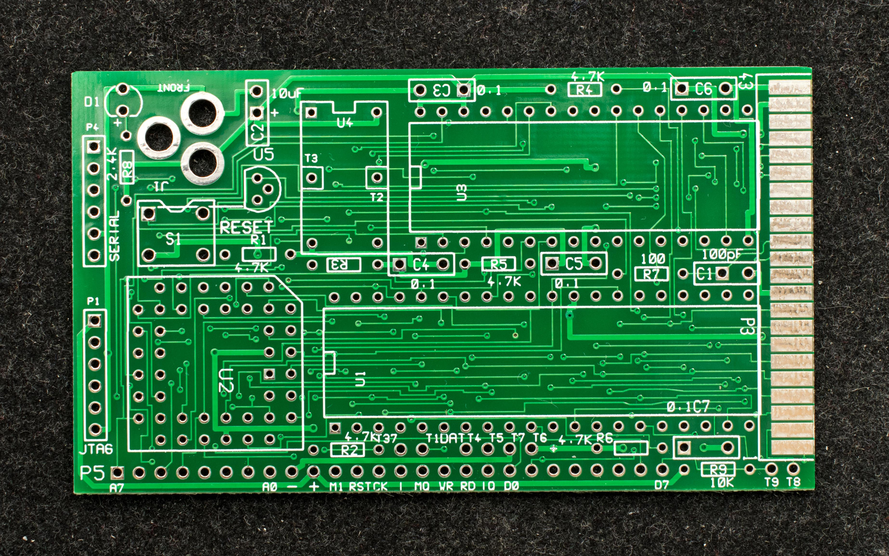

Solder side

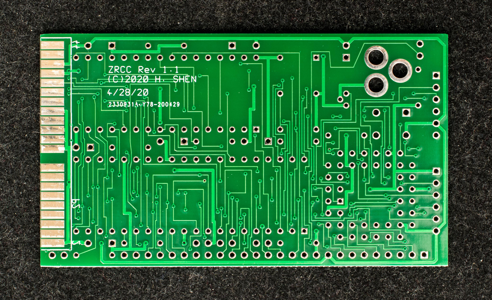

Install resistors first

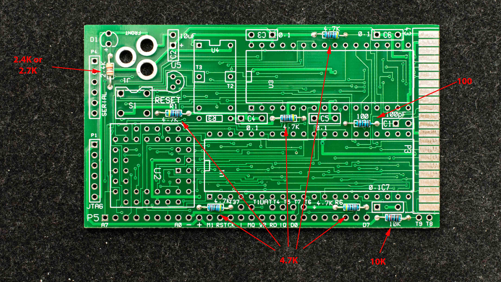

Install IC sockets next

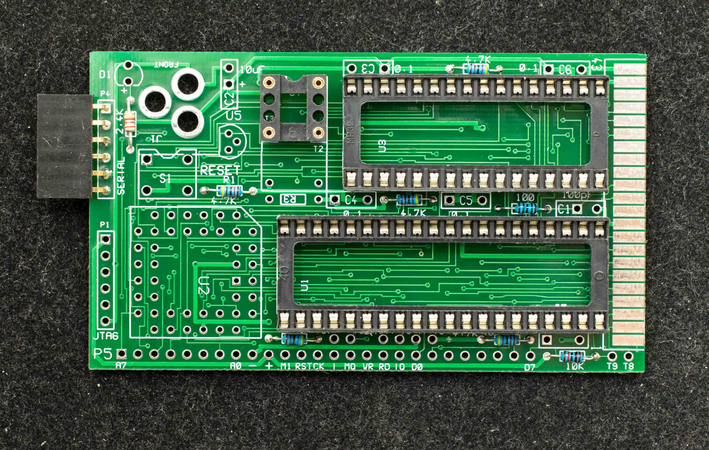

Install capacitors

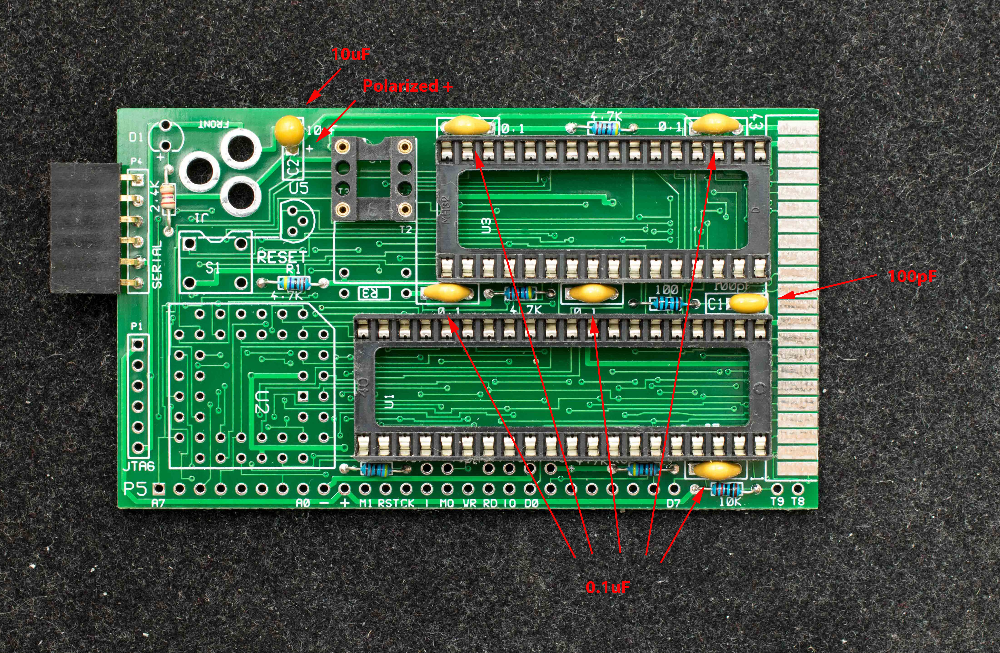

Observe the polarity of 10uF Tantalum capacitor and LED

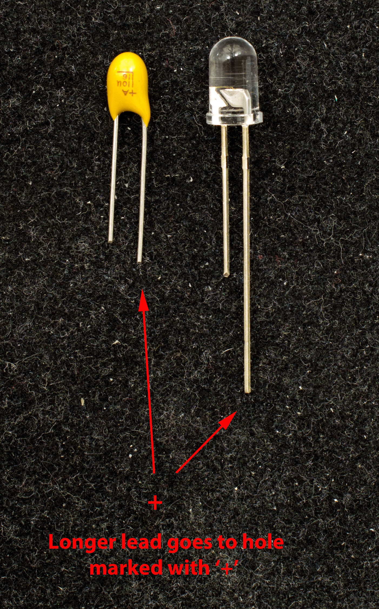

Install remaining hardware

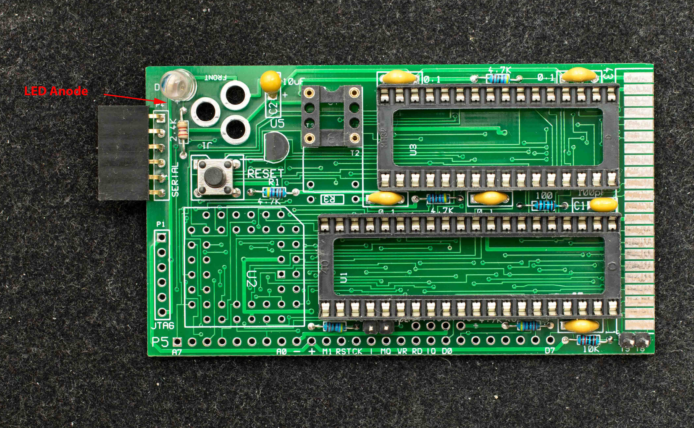

Install PLCC socket last

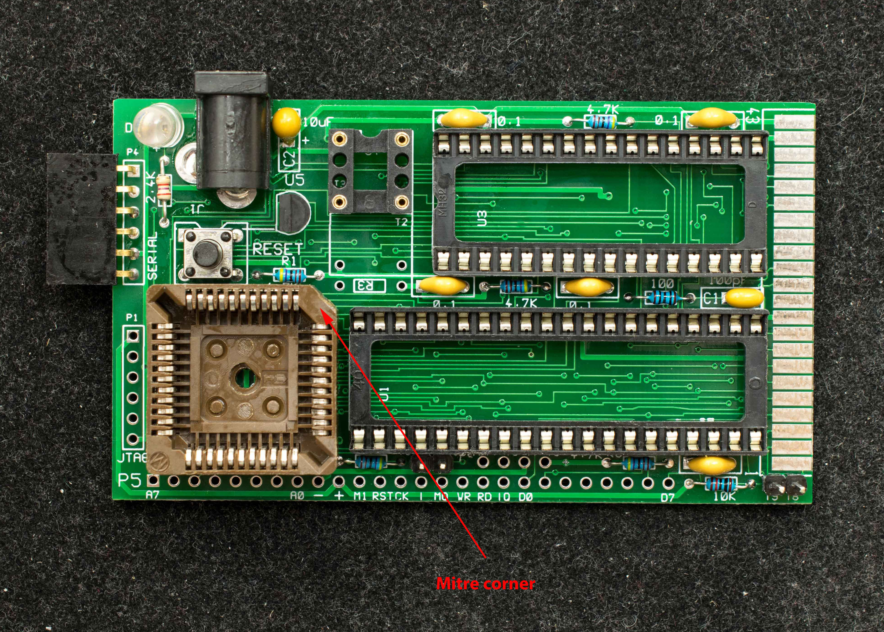

Completed ZRCC board, component side

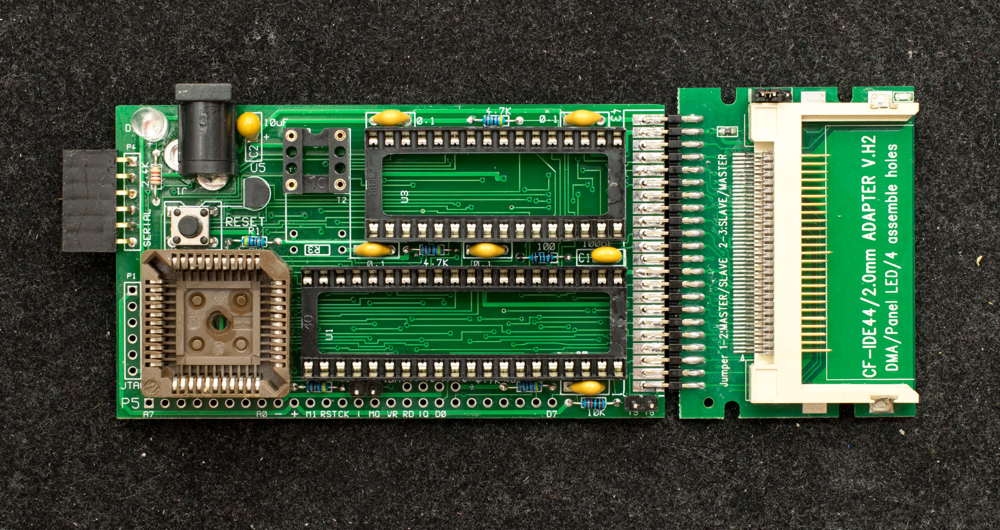

Completed ZRCC board, solder side

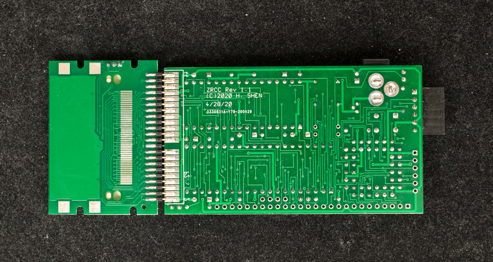

Populated ZRCC, ready to power up

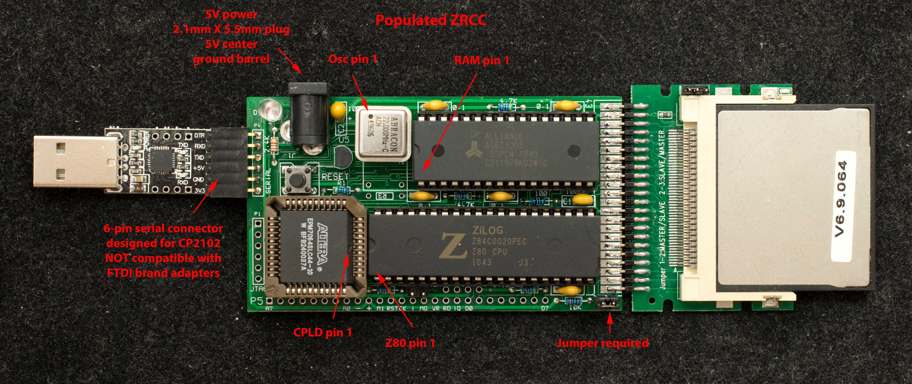
